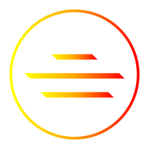

  

# 
 💻 About Me 

*Hi! My name is **Maxim** — I’m a beginner developer learning **`HTML`**, **`CSS`**, **`JavaScript`**, and a bit of **`C#`**, **`XAML`**.*

*I work in **Visual Studio Code** on **Linux (Fedora KDE Plasma)**.*

*I strive to write clean and well-structured code following **SOLID** and **BEM** principles — but sometimes I just follow my own creative ideas.* 😄

---

# 
 🚀 Skills & Tools 

- 🖌️ **Frontend**: HTML5, CSS3
- ⚙️ **JavaScript**
- 📦 **Tools**: Git, VS Code, Markdown
- 🐧 **OS**: Linux Fedora 42 KDE Plasma

---

# 
 📌 Current Focus 

- 🔭 Developing interactive web components and image galleries
- 🌐 Currently working on my **personal website** and creating a **template version** for other users
- 📚 Improving my JavaScript skills and responsive web design
- 🛠️ Experimenting with animations and UI optimizations

---

# 
 📫 How to reach me 

- ✉️ Email: `none`
- 💬 Telegram: [@UnSteD](https://t.me/UnSteD)

---

⭐ _"Code is like humor — when you have to explain it, it’s bad."_
